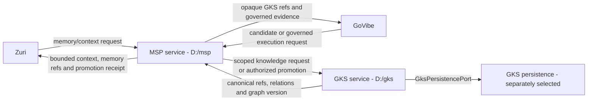

# GKS Integration Flow

## Target topology



Zuri and GoVibe do not receive GKS credentials or a direct GKS transport.

## Promotion flow

```text
1. GoVibe or another producer creates a provenance-bound candidate.
2. MSP records candidate state and applies review, scope, confidence, and policy.
3. MSP sends only an authorized promotion request to D:\gks.
4. GKS validates schema, scope, provenance, idempotency, and canonical conflicts.
5. GKS canonicalizes through GksPersistencePort in one transaction.
6. The approved GKS persistence adapter commits durable state and returns
   persistence evidence.
7. GKS returns candidate-to-canonical mapping plus graph version.
8. MSP validates the result and writes its msp:promotion receipt.
9. Zuri/GoVibe receive opaque references through MSP.
```

If any step fails, later receipts are not created. Neither MSP nor GoVibe may
invent a `gks:` reference.

## Retrieval flow for Zuri

```text
Zuri project/workstream request
  -> MSP resolves tenant/workspace/project identity and context policy
  -> MSP calls GKS with scope, seeds, relation allowlist, radius and budget
  -> GKS queries canonical knowledge within scope
  -> MSP selects, compacts and renders task/session context
  -> Zuri receives contextual knowledge plus opaque refs
```

GKS returns knowledge results; MSP decides what enters the current context.

## What remains in GoVibe

| Surface | Post-extraction treatment |
|---|---|
| `.govibe-knowledge-block` | remains project-local candidate/source material |
| GKS docs and vocabulary | remain as GoVibe governance and compatibility documentation, with links to standalone contract versions |
| direct `gks-client` shim | remains fail-closed to prove bypass is disabled |
| MSP/GKS fixtures | remain for conformance and rollback until independently retired |
| Deep Scan | continues producing candidates and calling MSP only |
| GKS credentials/config | forbidden in GoVibe |

## What remains in MSP

- GKS provider/client port and error mapping.
- Scope, context, candidate status, approval, and receipt ownership.
- `MSP_GKS_COMMAND`, `MSP_GKS_ARGS`, and `MSP_GKS_CWD` as local deployment
  configuration until a future transport decision.
- Fail-closed behavior when GKS is absent, unhealthy, or invalid.

MSP must not import GKS domain modules or any GKS persistence engine directly.

## Extraction and cutover phases

### Phase 0 - documentation approval

- Approve boundary, port, data model, and integration flow.
- Record amendments to GoVibe ADR-023/028 and API-010 before changing runtime.
- Add a governed task/work packet to the GoVibe plan of record.

Exit: owner approval is recorded; implementation remains unstarted before it.

### Phase 1 - standalone scaffold

Create in `D:\gks`:

```text
apps/gks-server/
packages/gks-core/
packages/gks-contracts/
packages/gks-client-js/
packages/gks-persistence/
tests/contract/
tests/security/
tests/integration/
docs/
```

Exit: dependency-boundary and transport framing tests pass; no consumer is
repointed.

### Phase 2 - API-010 compatibility slice

- Implement `gks_knowledge_promote` from the approved contract.
- Implement deterministic idempotency, provenance/hash validation, and
  structured results.
- Use a test adapter first; it is never a runtime fallback.

Exit: existing MSP provider fixtures pass unchanged against `D:\gks`.

### Phase 3 - GKS persistence decision and adapter

- Approve a separate ADR selecting the GKS persistence strategy.
- Implement `GksPersistencePort` with the selected adapter.
- Preserve one canonical write authority and adapter-owned durability.
- Prove restart persistence and conflicting-retry rejection.

GenesisBlockDB is outside this phase unless a later owner-approved integration
ADR explicitly selects it.

Exit: real persistence test passes across process restart with no partial write.

### Phase 4 - MSP consumer cutover

- Repoint only `D:\msp` provider configuration to the standalone GKS command.
- Do not remove the provider bridge.
- Run MSP contract, security, and integration suites.

Exit: MSP-to-GKS conformance passes; rollback command/config is recorded.

### Phase 5 - GoVibe compatibility proof

- Run GoVibe Deep Scan through external MSP and standalone GKS.
- Verify 12 terminal stages, graph validation, opaque refs, and no direct GKS
  configuration.
- Keep GoVibe local MSP/GKS compatibility surfaces until separately retired.

Exit: evidence proves behavior parity; no deletion is bundled with cutover.

### Phase 6 - Zuri integration

- Zuri connects to MSP only.
- Project/workstream requests carry portfolio/tenant/business/workspace/project
  scope.
- UI displays linked knowledge and candidates as contextual MSP results, not as
  Zuri-owned canonical rows.

Exit: scoped search, reference linking, and cross-tenant-deny tests pass.

## Verification matrix

| Gate | Required proof |
|---|---|
| Contract | API-010 parity; malformed frames/results rejected |
| Promotion | first write, same-key retry, conflicting retry, deduplication |
| Data | entity, relation, artifact link, atomic graph version |
| Scope | portfolio/workspace/project isolation and cross-tenant deny |
| Persistence | process restart returns the same canonical mapping |
| Boundary | source scan proves no Zuri/GoVibe direct GKS path |
| MSP | receipt created only after valid GKS commit |
| GoVibe | candidate flow and 12-stage evidence through MSP only |
| Zuri | Project-to-GKS references remain opaque and transaction rows are not copied |

A timeout or unavailable dependency is indeterminate/failure, never a pass.

## Rollback

- Repoint `MSP_GKS_COMMAND` to the previously verified provider or unset it to
  return to named fail-closed behavior.
- Do not delete canonical data during rollback.
- Do not silently fall back to an in-memory or GoVibe-local canonical store.
- Keep compatibility code until rollback and observation gates are accepted.

## Open gates after implementation

- The SQLite MVP decision is implemented; any persistence replacement requires
  a separate ADR and conformance proof.
- GoVibe's prior documents explicitly called a separate GKS service premature;
  GoVibe-side canonical docs still require a separately scoped amendment before
  deployment cutover.
- MSP standalone extraction is beta and its consumer cutover remains a separate
  gate; GKS extraction must not falsely claim that cutover is already complete.

## Implemented phase status

- Phase 0: complete — owner approval recorded.
- Phase 1: complete — standalone workspace and dependency tests exist.
- Phase 2: complete — API-010 promotion compatibility passes.
- Phase 3: complete for the approved SQLite MVP — restart persistence passes.
- Phase 4: compatibility proof complete, deployment cutover not performed.
- Phase 5: external MSP provider and full MSP service-chain proofs pass; GoVibe
  runtime was not modified and no retirement was performed.
- Phase 6: not started; Zuri remains a future MSP-client integration task.

## CHANGELOG

| Version | Date | Status | Summary | Commit Hash | Agent |
|---|---|---|---|---|---|
| 0.2.0b | 2026-08-12 | beta | Recorded completed standalone/API-010/SQLite/MSP compatibility phases and kept deployment cutover and Zuri integration explicitly open. | working-tree | ATHER |
| 0.1.2b | 2026-08-12 | beta | Owner approved the staged standalone GKS implementation and integration flow. | working-tree | Boss (บอส) / ATHER |
| 0.1.1b | 2026-08-12 | draft | Removed GenesisBlockDB from the GKS extraction topology and made GKS persistence a separate unresolved decision. | working-tree | ATHER |
| 0.1.0b | 2026-08-12 | draft | Proposed staged extraction and cutover flow preserving GoVibe compatibility and routing Zuri through MSP to standalone GKS. | working-tree | ATHER |
