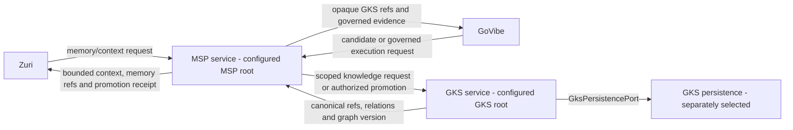

# GKS Integration Flow

## Legacy port-v3 target topology

The topology and promotion steps in this section describe the original
port-v3 compatibility flow. Deployment roots are configured by the operator;
the examples intentionally do not bind the contract to a machine-specific
checkout.



Zuri and GoVibe do not receive GKS credentials or a direct GKS transport.

## Legacy port-v3 promotion flow

```text
1. GoVibe or another producer creates a provenance-bound candidate.
2. MSP records candidate state and applies review, scope, confidence, and policy.
3. MSP sends only an authorized promotion request to the configured GKS root.
4. GKS validates schema, scope, provenance, idempotency, and canonical conflicts.
5. GKS canonicalizes through GksPersistencePort in one transaction.
6. The approved GKS persistence adapter commits durable state and returns
   persistence evidence.
7. GKS returns candidate-to-canonical mapping plus graph version.
8. MSP validates the result and writes its msp:promotion receipt.
9. Zuri/GoVibe receive opaque references through MSP.
```

If any step fails, later receipts are not created. Neither MSP nor GoVibe may
invent a `gks:` reference.

## GenesisRAG17 pull and receipt flow

The cross-repository stage definitions remain authoritative in zuri-ai:
[`KNOWLEDGE-INGESTION-17-STAGE-SPEC.md`](https://github.com/Freshair129/zuri-ai/blob/codex/ki17-integration/docs/KNOWLEDGE-INGESTION-17-STAGE-SPEC.md)
and its companion
[`KNOWLEDGE-INGESTION-17-STAGE-FLOW.md`](https://github.com/Freshair129/zuri-ai/blob/codex/ki17-integration/docs/KNOWLEDGE-INGESTION-17-STAGE-FLOW.md).
The current isolated execution and publication decision is [ADR-073 —
GenesisRAG17 isolated execution and publication](https://github.com/Freshair129/zuri.ai/blob/codex/ki17-integration/docs/decisions/ADR-073-GENESISRAG17-ISOLATED-EXECUTION-AND-PUBLICATION.md).
The verified zuri-ai acceptance record is pinned at
[`b64b46df057d3160c659afa3c34628ee86520257`](https://github.com/Freshair129/zuri-ai/commit/b64b46df057d3160c659afa3c34628ee86520257).
This repository documents the GKS side of that contract and does not copy
zuri-ai tracker state.

MSP is the sole GKS caller. It authenticates the runtime role and scope, then
forwards its configured relay credential and
`authenticatedPrincipal: { principalId, role, scope }`. GKS does not trust a
caller actor field and does not call MSP, zuri-ai or Tier 4.

```text
MSP relay invokes these server-side GKS operations; source/worker callers use
the corresponding authenticated MSP relay tools, never a direct GKS transport:
source principal
  -> gks_pipeline_submit
  -> immutable decision + terminal evidence for stages 9, 10, 11, 12
worker principal
  -> gks_pipeline_claim (non-destructive, limit 1)
  -> physical Tier-4 graph write/readback
  -> gks_pipeline_graph_receipt (actual Tier-4 graph readback)
  -> immutable Stage 13 receipt, then actual GKS enrich_v1 Stage 14
  -> gks_pipeline_write_receipt (actual Tier-4 stages 15 and 16)
  -> gks_pipeline_gate (five dimensions)
  -> gks_pipeline_publication_receipt (only after PASS, allowPublication=true,
     and the actual publication pointer/snapshot switch)
source principal
  -> gks_pipeline_evidence (cursor pull of immutable terminals)
```

The ordering is a durable protocol, not a suggested worker schedule. Stage 13
cannot close on a decision or a claimed write count: the graph receipt must
have matching scope, run, decision hash, stage identities, `readback.ok`, and
the physical node/edge counts derived from the immutable decision. Only after
that receipt commits does GKS compute and persist Stage 14's separate
`enrich_v1` payload and hash. The later receipt must reference both hashes and
actual Tier-4 vector/index readback. Stage 17 succeeds only when all required
lanes and retrieval thresholds pass and a publication receipt is accepted.
When the gate fails, GKS records terminal failed Stage 17 evidence with the
verdict and no publication receipt is expected.

The audit-remediated source path keeps Stage 9 identity type-aware. GKS uses
the pair `[norm_v1(resolutionKey), normalizeSemanticType(semanticType)]` for
lookup, decision grouping and persistence uniqueness while retaining every
original occurrence id and source type. Stage 10 carries a coordinated
subject only across supported `and`/`&` clauses when no new subject is named;
unsupported coordination is held with `ambiguous_subject_binding` rather than
using the prior object as a subject, and negated relations are dropped from
verified facts. Stage 12 writes `not_applicable` for text with
no temporal claim, an ISO start plus `null` for a supported open interval, and
holds an actual but unsupported temporal expression with reason
`temporal_unmapped` and its source references. It never emits that expression
as a verified `null`/`null` fact; reversed intervals become HELD evidence with
`invalid_temporal_order`. Structured temporal metadata is rejected until a
separate wire contract exists. Canonical lookup is included in the Stage 9
elapsed interval and local stage metrics count the work actually processed.

Each stage identity is the tuple `runId`, `pipelineStageId`,
`executionStepId`, and `attemptId` with its stage number. A transport retry
reuses the same batch or receipt payload and returns the stored hash. A
processing retry starts a new FR071 materialized replay from the Tier-1 raw
entrypoint, receiving new batch, decision, run and stage-attempt identities;
the existing immutable decision is never mutated by changing only
`attemptId`. `gks_pipeline_stage_failure` is available to the worker only for
stages 13, 15, and 16; it records the actual failed stage and prevents later
synthetic success evidence.

## GenesisRAG17 extension boundary

Future features extend the pipeline through a new approved contract or a
versioned artifact. They keep existing `DPS-KI-*` ids, stage meanings, array
order, source occurrence ids, hashes and receipt identity stable. A new
`rule_v2`, ontology alias, temporal parser, graph projection, or enrichment
method must name its version, update the relevant ADR and tests, and change
the decision/receipt hash inputs deliberately. It must not silently edit
`rule_v1`, `ontology_v1`, the temporal sentinel meanings, or the legacy
port-v3 evidence reader. Query-time retrieval orchestration after a completed
Stage 17 publication is a consumer flow; it is not a Stage 18.

## Retrieval flow for Zuri

```text
Zuri project/workstream request
  -> MSP resolves tenant/workspace/project identity and context policy
  -> MSP calls GKS with scope, seeds, relation allowlist, radius and budget
  -> GKS queries canonical knowledge within scope
  -> MSP selects, compacts and renders task/session context
  -> Zuri receives contextual knowledge plus opaque refs
```

GKS returns knowledge results; MSP decides what enters the current context.

## What remains in GoVibe

| Surface | Post-extraction treatment |
|---|---|
| `.govibe-knowledge-block` | remains project-local candidate/source material |
| GKS docs and vocabulary | remain as GoVibe governance and compatibility documentation, with links to standalone contract versions |
| direct `gks-client` shim | remains fail-closed to prove bypass is disabled |
| MSP/GKS fixtures | remain for conformance and rollback until independently retired |
| Deep Scan | continues producing candidates and calling MSP only |
| GKS credentials/config | forbidden in GoVibe |

## What remains in MSP

- GKS provider/client port and error mapping.
- Scope, context, candidate status, approval, and receipt ownership.
- `MSP_GKS_COMMAND`, `MSP_GKS_ARGS`, and `MSP_GKS_CWD` as local deployment
  configuration until a future transport decision.
- Fail-closed behavior when GKS is absent, unhealthy, or invalid.

MSP must not import GKS domain modules or any GKS persistence engine directly.

## Extraction and cutover phases

### Phase 0 - documentation approval

- Approve boundary, port, data model, and integration flow.
- Record amendments to GoVibe ADR-023/028 and API-010 before changing runtime.
- Add a governed task/work packet to the GoVibe plan of record.

Exit: owner approval is recorded; implementation remains unstarted before it.

### Phase 1 - standalone scaffold

Create in the configured GKS root (`$gksRoot`):

```text
apps/gks-server/
packages/gks-core/
packages/gks-contracts/
packages/gks-client-js/
packages/gks-persistence/
tests/contract/
tests/security/
tests/integration/
docs/
```

Exit: dependency-boundary and transport framing tests pass; no consumer is
repointed.

### Phase 2 - API-010 compatibility slice

- Implement `gks_knowledge_promote` from the approved contract.
- Implement deterministic idempotency, provenance/hash validation, and
  structured results.
- Use a test adapter first; it is never a runtime fallback.

Exit: existing MSP provider fixtures pass unchanged against `$gksRoot`.

### Phase 3 - GKS persistence decision and adapter

- Approve a separate ADR selecting the GKS persistence strategy.
- Implement `GksPersistencePort` with the selected adapter.
- Preserve one canonical write authority and adapter-owned durability.
- Prove restart persistence and conflicting-retry rejection.

GenesisBlockDB is outside this phase unless a later owner-approved integration
ADR explicitly selects it.

Exit: real persistence test passes across process restart with no partial write.

### Phase 4 - MSP consumer cutover

- Repoint only the configured MSP root (`$mspRoot`) provider configuration to
  the standalone GKS command.
- Do not remove the provider bridge.
- Run MSP contract, security, and integration suites.

Exit: MSP-to-GKS conformance passes; rollback command/config is recorded.

### Phase 5 - GoVibe compatibility proof

- Run GoVibe Deep Scan through external MSP and standalone GKS.
- Verify 12 terminal stages, graph validation, opaque refs, and no direct GKS
  configuration.
- Keep GoVibe local MSP/GKS compatibility surfaces until separately retired.

Exit: evidence proves behavior parity; no deletion is bundled with cutover.

### Phase 6 - Zuri integration

- Zuri connects to MSP only.
- Project/workstream requests carry portfolio/tenant/business/workspace/project
  scope.
- UI displays linked knowledge and candidates as contextual MSP results, not as
  Zuri-owned canonical rows.

Exit: scoped search, reference linking, and cross-tenant-deny tests pass.

## Verification matrix

| Gate | Required proof |
|---|---|
| Contract | API-010 parity; malformed frames/results rejected |
| Promotion | first write, same-key retry, conflicting retry, deduplication |
| Data | entity, relation, artifact link, atomic graph version |
| Scope | portfolio/workspace/project isolation and cross-tenant deny |
| Persistence | process restart returns the same canonical mapping |
| Boundary | source scan proves no Zuri/GoVibe direct GKS path |
| MSP | receipt created only after valid GKS commit |
| GoVibe | candidate flow and 12-stage evidence through MSP only |
| Zuri | Project-to-GKS references remain opaque and transaction rows are not copied |

A timeout or unavailable dependency is indeterminate/failure, never a pass.

## Rollback

- Repoint `MSP_GKS_COMMAND` to the previously verified provider or unset it to
  return to named fail-closed behavior.
- Do not delete canonical data during rollback.
- Do not silently fall back to an in-memory or GoVibe-local canonical store.
- Keep compatibility code until rollback and observation gates are accepted.

## Open gates after implementation

- The SQLite MVP decision is implemented; any persistence replacement requires
  a separate ADR and conformance proof.
- GoVibe's prior documents explicitly called a separate GKS service premature;
  GoVibe-side canonical docs still require a separately scoped amendment before
  deployment cutover.
- MSP standalone extraction is beta and its consumer cutover remains a separate
  gate; GKS extraction must not falsely claim that cutover is already complete.

## Implemented phase status

- Phase 0: complete — owner approval recorded.
- Phase 1: complete — standalone workspace and dependency tests exist.
- Phase 2: complete — API-010 promotion compatibility passes.
- Phase 3: complete for the approved SQLite MVP — restart persistence passes.
- Phase 4: compatibility proof complete, deployment cutover not performed.
- Phase 5: external MSP provider and full MSP service-chain proofs pass; GoVibe
  runtime was not modified and no retirement was performed.
- Phase 6: not started; Zuri remains a future MSP-client integration task.

The GenesisRAG17 GKS baseline is implemented in the additive migration 0006
surface. Its deployment and zuri-ai ledger cutover remain separate release
gates even when the local provider and service-chain proofs pass.

## CHANGELOG

| Version | Date | Status | Summary | Commit Hash | Agent |
|---|---|---|---|---|---|
| 0.3.3b | 2026-09-08 | beta | Recorded audit-remediated Stage 9 typed identity, supported-only Stage 10 subject carry with `ambiguous_subject_binding` holds, conservative negation, Stage 12 temporal states and measured lookup timing under the frozen relay flow. | working-tree | RWANG |
| 0.3.2b | 2026-09-08 | beta | Clarified MSP relay mediation, physical Tier-4 graph readback before the GKS graph receipt, publication prerequisites (`PASS`, `allowPublication`, and pointer switch), and materialized replay identity. | 9279cfe | RWANG |
| 0.3.0b | 2026-09-08 | beta | Added the cross-repository GenesisRAG17 links, authenticated pull/receipt sequence, terminal failure and replay rules, and the versioned extension boundary. | 9279cfe | RWANG |
| 0.2.0b | 2026-08-12 | beta | Recorded completed standalone/API-010/SQLite/MSP compatibility phases and kept deployment cutover and Zuri integration explicitly open. | working-tree | ATHER |
| 0.1.2b | 2026-08-12 | beta | Owner approved the staged standalone GKS implementation and integration flow. | working-tree | Boss (บอส) / ATHER |
| 0.1.1b | 2026-08-12 | draft | Removed GenesisBlockDB from the GKS extraction topology and made GKS persistence a separate unresolved decision. | working-tree | ATHER |
| 0.1.0b | 2026-08-12 | draft | Proposed staged extraction and cutover flow preserving GoVibe compatibility and routing Zuri through MSP to standalone GKS. | working-tree | ATHER |

## Reference version diff — 2026-09-08

"0.3.3b → 0.3.4b: follow zuri's pre-merge ADR-071 → ADR-073 collision repair because published main owns ADR-071 for CRM. Historical revision rows and pinned acceptance reports retain their original identifiers. Protocol and runtime behavior are unchanged.
