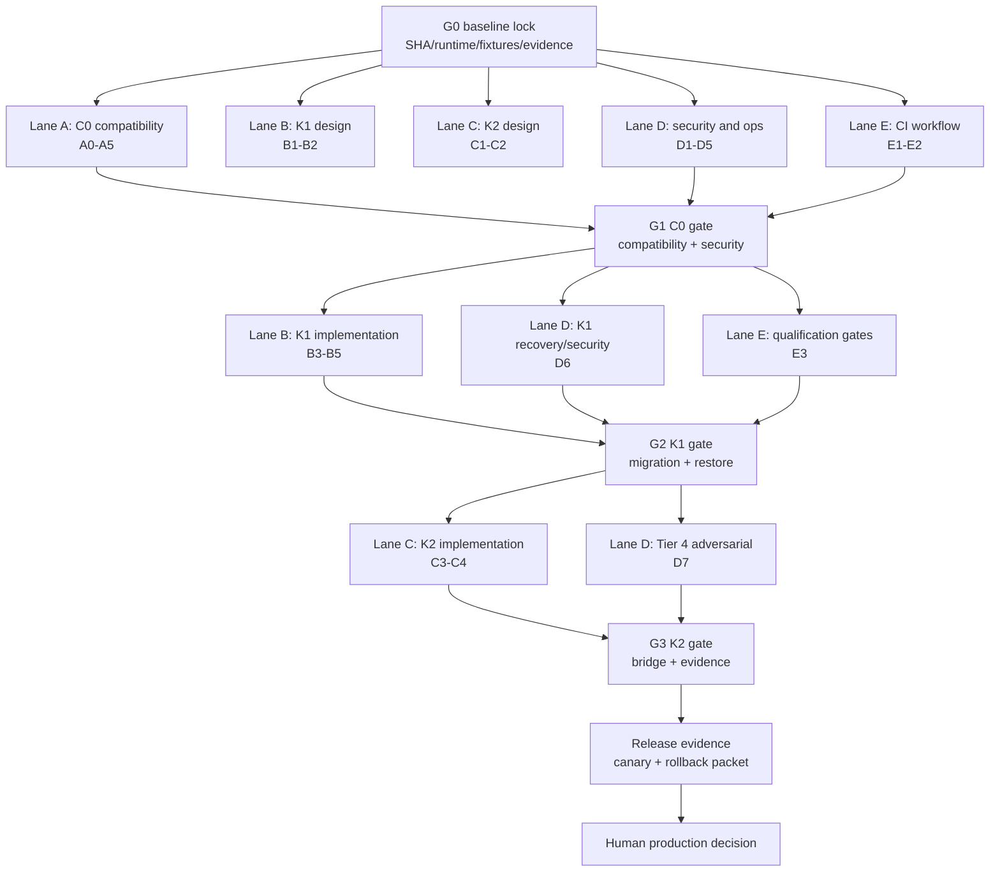

# GKS SRS blueprint — parallel implementation plan and workflow

## Decision

Implement the blueprint in gated vertical slices while keeping the existing
C0 GKS contract frozen. GKS remains the canonical SQLite authority and a
passive MSP-only service. GenesisBlockDB/Tier 4 remains an external,
MSP-mediated derived graph/vector/index authority; GKS must not acquire a
direct Tier 4 connection.

This document is the approved implementation plan. It is not an assertion
that K1, K2, Tier 4, or production readiness is already implemented.

## Assumptions and boundaries

1. The extracted blueprint is `0.1.0-proposed` with approval pending; it is a
   design input, not current runtime evidence.
2. The repository baseline is `be97c93`; current untracked `_inbox/`,
   `mission-control-site/`, and `mission-control-site.tar.gz` belong to the
   user and must not be staged by this plan.
3. Existing C0 behavior, hashes, scopes, tool names, receipts, and the two
   evidence ledgers are compatibility surfaces until an explicit amended ADR
   says otherwise.
4. Local, CI, cross-repository, fixture, and production evidence must remain
   separate. `NOT_RUN` and `BLOCKED` are not green results.
5. No deployment, migration, cutover, commit, or push is authorized by this
   plan alone.

## Risk and definition of done

Risk: **HIGH**. The work changes security boundaries, persistence, immutable
receipts, cross-repository contracts, and eventual retrieval semantics.

The program is done only when:

- C0 has a pinned golden corpus and a real MSP provider-chain qualification
  with zero unexplained skips.
- K1 migrations are additive, deterministic, restartable, checksummed, and
  proven reversible through an approved restore/replay procedure.
- K2 has a qualified worker/DB path with manifest, capability, receipt,
  revocation, citation, and exact-vs-ANN evidence.
- Required tests and documentation pass their gates, and production remains
  closed until a signed human release decision exists.

## Known gaps that must remain visible

- `visible()` has a candidate empty-tenant broadening path while SQL reads use
  exact tenant predicates; this must be resolved before C0 qualification.
- Legacy API-010 dispatch does not yet prove the same authenticated MSP
  relay/principal boundary as the pipeline API.
- NDJSON dispatch does not visibly prove frame-size, depth, duplicate-key, and
  raw-boundary limits.
- The official C0 golden registry/hash/scope/receipt corpus is not yet clearly
  present in the checkout.
- K1 immutable revisions/claims/annotations/profiles/outbox are specified but
  not implemented.
- K2 planning, worker acceptance, capability negotiation, and real Tier 4
  readback are specified but not implemented.

## Parallel DAG

The first node is serial because every lane needs the same baseline and
evidence vocabulary. Work after a gate may run concurrently only when its
write scope is disjoint. Integration, migration, qualification, and release
nodes are serial gates.



## Work lanes

| Lane | Parallel scope | Deliverables | Must wait for |
|---|---|---|---|
| A — C0 | Existing tools, transport, scope, evidence, GenesisRAG17 | C0 characterization, bounded transport proof, tenant/auth fixes, receipt tests, real MSP qualification | G0; A5 is a gate |
| B — K1 | Additive model, immutable revisions, SQLite migrations, backfill | K1 contracts/core, additive migrations, deterministic mapping, serial service integration | G1 before writes |
| C — K2 | Retrieval plan, manifest, worker protocol, acceptance | K2 contracts, capability negotiation, HQL2/typed IR boundary, evidence/readback | G2; real Tier 4 for C4 |
| D — security/ops | Adversarial, protocol, durability, performance, migration, rollback | security matrix, recovery evidence, SLO report, restore/replay packet | G0; each release gate |
| E — CI | Required PR CI and protected qualification workflow | `gks-ci`, `gks-qualification`, result/artifact schema, aggregate gates | G0; protected-branch approval |

## Slice order and exit criteria

### G0 — baseline and evidence lock (serial)

- Pin GKS SHA, Node versions, lockfiles, MSP revision, fixture versions, and
  the current 17-tool registry.
- Capture accepted/denied requests, exact hashes, scope envelopes, opaque
  references, both evidence ledgers, and current skip reasons.
- Produce a machine-readable run manifest and a golden corpus.

Exit: the corpus reproduces current C0 behavior; every missing external
capability is labelled `NOT_RUN` or `BLOCKED`.

### Lane A — C0 compatibility (serial inside the lane)

1. A0 freeze the 17-tool registry and golden corpus.
2. A1 qualify startup and bounded NDJSON/JSON-RPC framing, including malformed,
   oversized, deeply nested, duplicate-key, and stderr-only cases.
3. A2 resolve empty-tenant isolation and decide the legacy API-010 MSP auth
   boundary; test forged principal/proof and cross-tenant reads.
4. A3 preserve resolver ladder, atomic uniqueness, BIND/MERGE, and legacy
   evidence cursor semantics.
5. A4 qualify GenesisRAG17 submit/claim/receipt/failure/gate/publication
   ordering, duplicate handling, wrong-hash/scope/stage rejection, and crash
   recovery.
6. A5 run the real pinned MSP provider/service chain with no unexplained skips.

Exit: C0 behavior is compatibility-qualified and does not imply K1/K2 or
production readiness.

### Lane B — K1 persistence and governance

The design sublane B1/B2 may proceed in parallel after G0, but migrations and
runtime writes wait for G1.

1. Freeze contracts for revisions, entity heads, claims, annotations,
   provenance, profiles, counters, and capabilities.
2. Implement pure immutable revision/CAS/temporal/disposition semantics.
3. Add migrations after `0006` only; do not paste the reference schema over
   the C0 schema or alter `0001`–`0006`.
4. Build deterministic, restartable, checksummed legacy mapping with an
   exception ledger for ambiguous scope/type/time/hash cases.
5. Integrate serially at the existing persistence/service boundary, preserving
   C0 fail-closed behavior.

Exit: isolated migration rehearsal, backup/restore, CAS/concurrency,
temporal-profile, redaction, and rollback/replay evidence all pass.

### Lane C — K2 retrieval bridge

1. Define authorized retrieval plan, nonce/expiry, publication manifest, and
   capability contract.
2. Keep the call path `MSP -> GKS plan -> MSP worker -> Tier 4 -> MSP -> GKS
   acceptance`; GKS owns no Tier 4 URL or credential.
3. Make exact, lexical, graph, temporal, vector, and fused results explicit.
   ANN shortlist/rerank must never be labelled global exact top-k.
4. Recheck scope, grant, revocation, manifest hash, citations, and receipt
   coverage before returning an evidence bundle.
5. Run a real worker/DB fixture for exact-vs-ANN, temporal boundaries,
   revocation, crash/replay, and readback.

Exit: real Tier 4 evidence proves capability negotiation, pinned snapshot or
frontier, receipt integrity, citation correctness, and zero cross-scope leaks.

### Lane D — security, reliability, and operations

Run D1-D5 in parallel after G0; keep D6/D7 serial with the relevant gates.

- D1: forged refs, wrong role/relay, cross-tenant, replay, revocation, and
  identity/evidence separation.
- D2: oversized/deep/duplicate JSON, Unicode, notification/batch/cancel,
  secret/env allowlists, `NODE_OPTIONS`, path/SSRF, profile tampering, and
  redaction.
- D3: kill/restart at durable boundaries, disk-full, receipt reconciliation,
  pending work, backup/restore, readiness, and metrics.
- D4: Thai/English/emoji/collision/high-degree datasets, concurrency, p50/p95/
  p99 latency, RSS, correctness, recall, MRR, and citation accuracy.
- D5: pre-write revert safety, post-write restore/replay, migration hashes,
  shadow read, and no dual-write ambiguity.
- D6: real MSP ↔ GKS ↔ worker ↔ Tier 4 qualification.
- D7: release evidence, canary, observability, rollback, and human signoff.

Exit: no security or recovery result is hidden behind a timeout, skip, or
synthetic empty response.

### Lane E — CI and qualification workflow

#### `gks-ci` — PR and push workflow

Required jobs:

```text
reference_matrix
c0_local_matrix (Node 22/24 × contract/integration/security/unit/client-pack)
pr-required (if: always; fails on required failure)
```

This workflow is fast and reproducible. It may report MSP/Tier 4 as
`NOT_RUN`, but it must never call that a C0/K1/K2 qualification.

#### `gks-qualification` — protected/manual workflow

```text
prepare
  ├─ reference_matrix
  ├─ c0_golden
  ├─ c0_msp_real
  └─ c0_local_matrix
       ↓
     c0_gate
       ↓
  ├─ k1_contract
  ├─ k1_migration_persistence_restart
  ├─ k1_security_profile
  └─ k1_msp_real
       ↓
     k1_gate
       ↓
  ├─ k2_contract
  ├─ k2_tier4_real
  └─ k2_reconciliation_security_sdk
       ↓
     k2_gate
       ↓
  release_evidence → release_gate
```

Every matrix uses `fail-fast: false`; aggregate jobs use `if: always()` and
fail on required `FAIL`, `BLOCKED`, or `NOT_RUN`. No `continue-on-error` may
turn a required qualification into green.

Required artifacts contain no secrets:

- `run-manifest.json`: SHAs, runtimes, lockfile hashes, fixture IDs.
- `lane-result.json`: `PASS | FAIL | NOT_RUN | BLOCKED` plus reason and scope.
- test output, C0/K1/K2 gate reports, backup/restore result, and release
  readiness packet.

Branch protection should require only the appropriate aggregate job for normal
PRs; protected qualification environments must require pinned external
revisions and a human production gate.

## Gate register

| Gate | Approval condition | Blocks |
|---|---|---|
| G0 | Golden corpus, baseline SHA, runtime tuple, and evidence taxonomy accepted | All implementation lanes |
| G1 | C0 transport, scope/auth, persistence, and receipt design accepted | K1 runtime writes |
| G2 | K1 schema, migration, mapping, restore, and rollback evidence accepted | K2 bridge |
| G3 | K2 worker/DB, receipt, revocation, exact-vs-ANN, and citation evidence accepted | Release packet |
| R | Signed human decision with canary, observability, and rollback artifact | Production activation |

## Implementation rules after approval

- Create or amend the relevant ADR/contracts before each code slice; do not
  implement K1/K2 from the blueprint alone.
- Keep lane write scopes disjoint and merge serially through the gate owner.
- Add tests before behavior changes and preserve the old C0 conformance suite.
- Do not use the untracked extracted package as CI evidence until it is
  reviewed, promoted, and tracked intentionally.
- Report local, CI, cross-repository, fixture, and production evidence in
  separate sections.

## Change log

| Version | Date | Status | Summary | Commit Hash | Agent |
|---|---|---|---|---|---|
| 0.1.0b | 2026-09-22 | candidate | Initial approved parallel implementation and qualification workflow | working-tree | RWANG |

## Approval status

User approval received for this plan on 2026-09-22. This approves the plan and
parallel orchestration; it does not authorize production deployment or a
commit/push. The next implementation step is G0 baseline lock, followed by the
ADR/contract review for G1.
